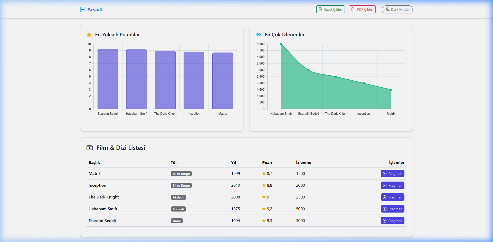
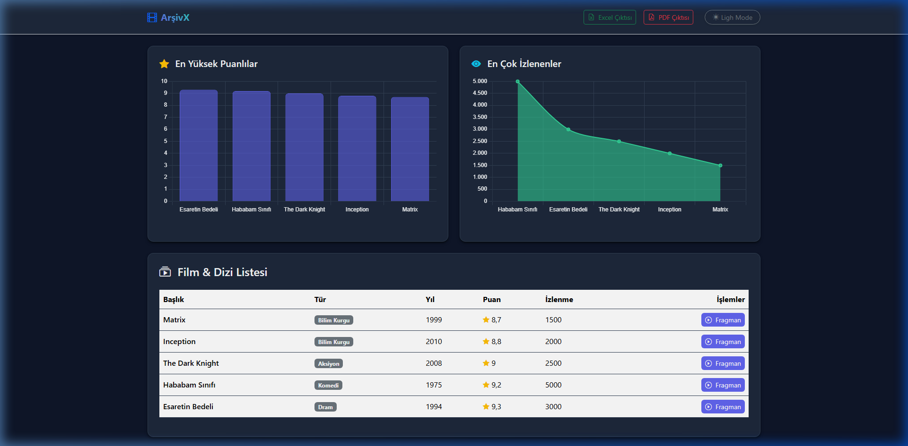
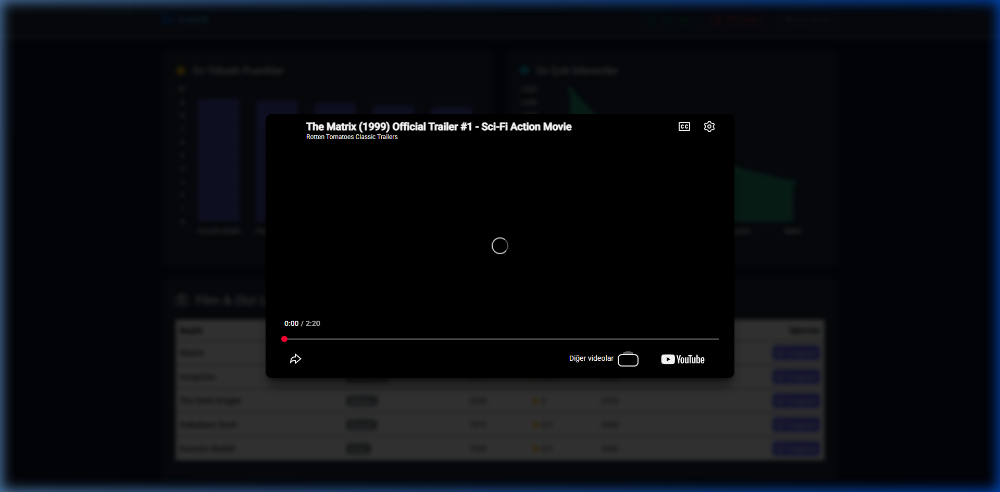

# Film & Dizi Arşivi 🎬

Modern .NET 9 özellikleri ve şık tasarımıyla inşa edilmiş profesyonel bir film ve dizi arşiv projesi.

## 🚀 Özellikler

- **Güçlü Mimari**: .NET 9 MVC ve Entity Framework Core kullanılarak, Servis Katmanı tasarım desenleri ve Bağımlılık Enjeksiyonu (DI) ile inşa edildi.
- **Premium Arayüz & Koyu Tema**: `color-scheme` optimizasyonları sayesinde cihaz ayarlarıyla senkronize olan, profesyonel ve modern estetik. Kullanıcı tercihlerini hatırlar.
- **Raporlama & Veri Dışa Aktarma**: ClosedXML ve QuestPDF ile yüksek performanslı, tamamen bellek üzerinden (in-memory) Excel ve PDF rapor üretimi.
- **Görsel Analizler**: Tema motoruna tam uyumlu, CSS değişkenleriyle renk değiştiren interaktif Chart.js entegrasyonu.
- **Erişilebilirlik & Kullanıcı Deneyimi**: Klavye odağını koruyan, sayfa kaydırmasını engelleyen (scroll-lock) ve iframe temizleme özelliğiyle arka planda ses çalmasını önleyen gelişmiş JavaScript ModalManager.
- **Savunmacı Programlama**: FluentValidation ile veri doğrulama ve özel ExceptionHandlingMiddleware ile güvenli hata yönetimi.

## 🛠 Teknoloji Yığını

- **Framework**: C# .NET 9 ASP.NET Core MVC
- **Veritabanı**: SQLite & EF Core 9
- **Doğrulama**: FluentValidation
- **Dışa Aktarma**: QuestPDF, ClosedXML
- **Frontend**: HTML5, Vanilla JavaScript, CSS3 Değişkenleri, Chart.js, Bootstrap 5

## 📦 Kurulum

Bu projeyi yerelinizde çalıştırmak için .NET 9 SDK'nın yüklü olduğundan emin olun.

1. Projeyi klonlayın:
```bash
git clone https://github.com/taklaci59/filmdiziarsivi.git
```
2. Proje dizinine gidin:
```bash
cd filmdiziarsivi
```
3. Veritabanı taşıma (migration) ve veri tohumlama (seeding) işlemleri başlangıçta otomatik olarak çalışacaktır.
4. Projeyi çalıştırın:
```bash
dotnet run
```
5. Tarayıcınızda terminalde belirtilen adresi (örneğin `http://localhost:5193`) açın.

## 📸 Ekran Görüntüleri

### Ana Sayfa (Açık Tema)


### Ana Sayfa (Koyu Tema)


### Fragman Modalı


---
> **Geliştirici:** **Kıvanç** - Antigravity AI Tarafından Portfolyo Mükemmelliği İçin Tasarlandı.
