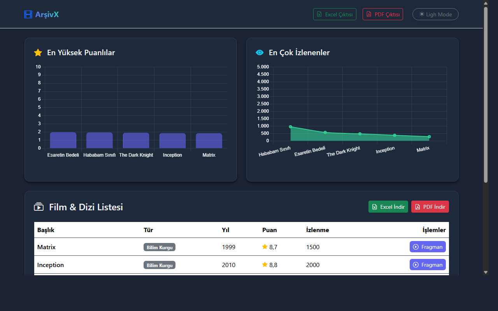

# 🎬 Film & Dizi Arşivi



Kişisel film ve dizi koleksiyonunu yönetebileceğin, izleme durumunu takip edebileceğin ve puanlama yapabileceğin kapsamlı bir arşiv sistemi.

## 🚀 Özellikler
- Film ve dizi ekleme, düzenleme, silme
- İzleme durumu takibi (İzlendi / İzlenecek / İzleniyor)
- Puanlama ve not sistemi
- Karanlık / Açık tema desteği
- Responsive tasarım (Bootstrap 5)

## 🛠️ Kullanılan Teknolojiler
- **Backend:** ASP.NET Core MVC (.NET 9)
- **ORM:** Entity Framework Core
- **Veritabanı:** SQL Server LocalDB
- **Frontend:** Bootstrap 5, Bootstrap Icons

## ⚙️ Kurulum

### Gereksinimler
- .NET 9 SDK
- SQL Server LocalDB

### Adımlar
```bash
# Repoyu klonla
git clone https://github.com/taklaci59/filmdiziarsivi.git
cd filmdiziarsivi

# Veritabanını oluştur
dotnet ef database update

# Uygulamayı çalıştır
dotnet run
```

Tarayıcıda `https://localhost:5001` adresini aç.

## 🗄️ Veritabanı
Bağlantı dizesi `appsettings.json` içinde tanımlıdır:
```
Server=(localdb)\mssqllocaldb;Database=FilmDiziArsiviDb;Trusted_Connection=True
```

## 👤 Geliştirici
**Kıvanç** — [GitHub](https://github.com/taklaci59)
